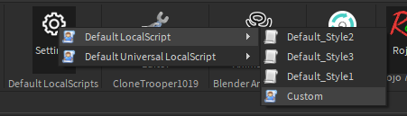

# DefaultLocalScripts
DefaultLocalScripts is a Roblox Studio plugin that changes the default content of new LocalScripts in case you're sick of seeing `print("Hello world")`.

It is also very useful for use with [UniversalLocalScripts](https://github.com/Noobot9k/UniversalLocalScripts), a module that allows LocalScripts to run in the workspace among other places.

This plugin allows you to choose what code your new LocalScripts contain by default. You can select from a few existing styles or write your own.



This plugin will also intelligently identify if the location you're creating a LocalScript in is one where it will run as a Universal LocalScript and change the default content of the script accordingly.

This plugin can also automatically credit you if you'd like.

```lua
-- Created by Noobot9k

Print("Hello world")
```

## Install

Either install the plugin from Roblox's website [here](https://create.roblox.com/store/asset/6708420842/Default-LocalScript-changer) or download the latest release [here](https://github.com/Noobot9k/DefaultLocalScripts/releases) and place it in your local plugins folder ('C:\Users\USERNAME\AppData\Local\Roblox\Plugins' by default. In Roblox Studio select Plugins>Plugins Folder to open the folder.)

### Rojo
This project is using [Rojo](https://github.com/rojo-rbx/rojo) 7.4.1.

If you're using Rojo / want to build from source you can start by cloning this repo.

First, to build the place from scratch, use:

```bash
rojo build -o "DefaultLocalScripts.rbxlx"
```

(For Rojo help, check [the Rojo documentation](https://rojo.space/docs).)

Next, open `DefaultLocalScripts.rbxlx` in Roblox Studio.

Navigate in the Explorer to `ReplicatedFirst.DefaultLocalScripts` and right click it>Save as Local Plugin